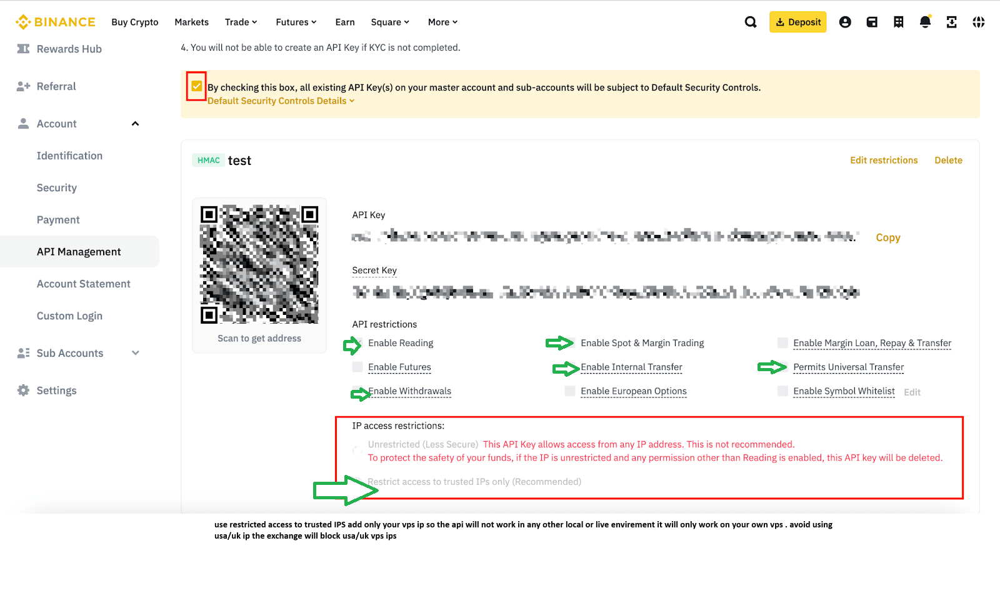
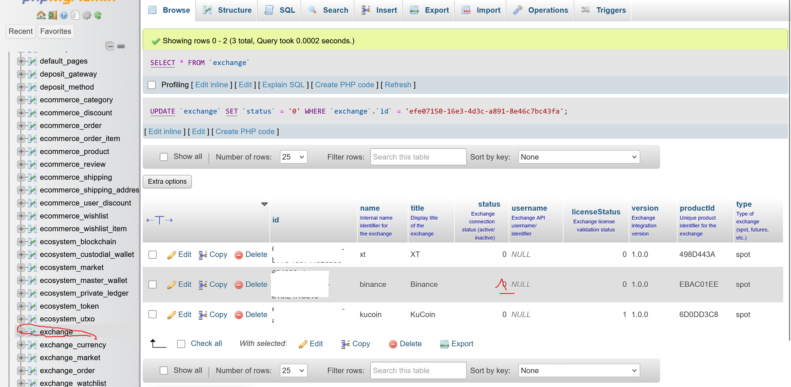
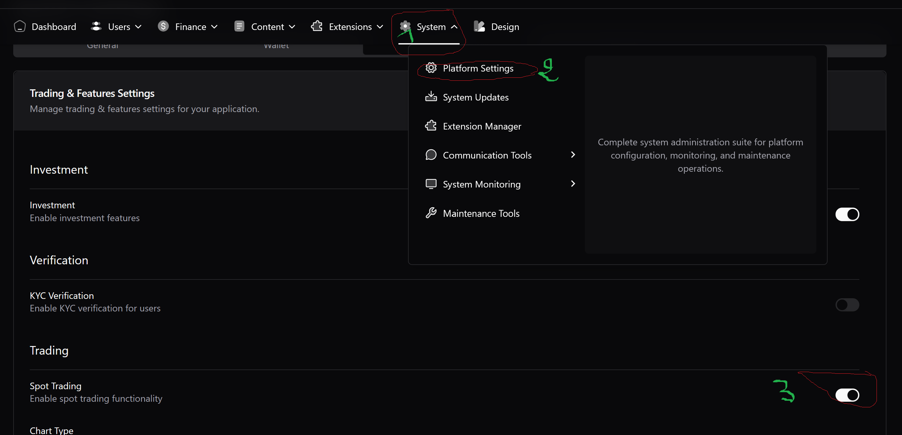
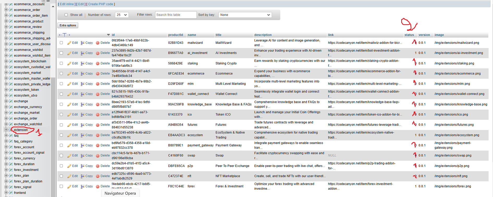
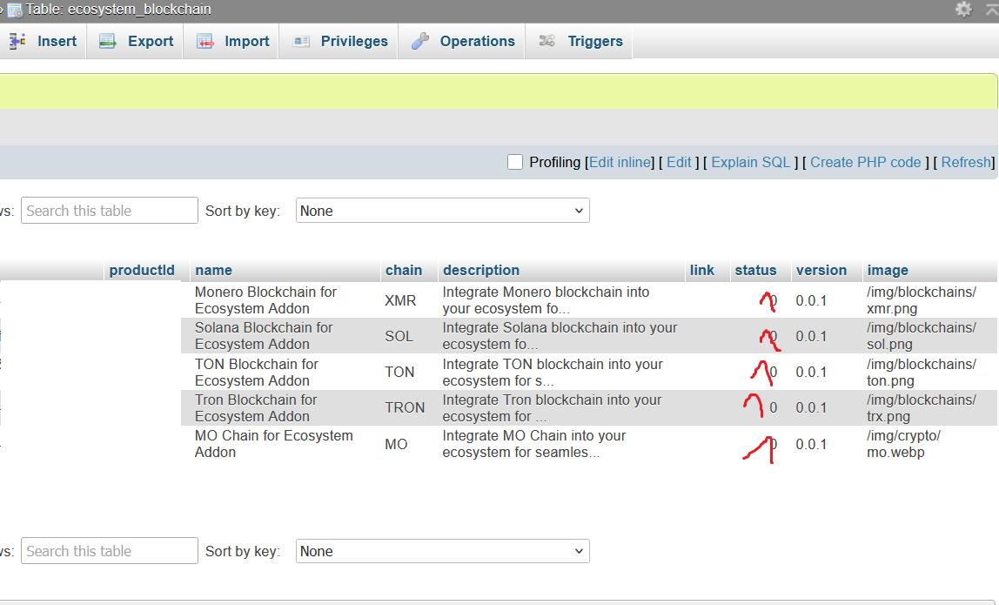

# This is the CEX Code for team to develop frontend & backend🧑‍💻
-----

## ✅ Prerequisites

Before you begin, ensure you have the following:

  * A VPS running **Ubuntu** install virtualmin
  * API keys from your desired exchanges (e.g., Binance, KuCoin, XT.com) with **trading**  **withdrawal**  **deposit** permissions **enabled**.
  * Your VPS IP address **whitelisted** in your exchange API settings.

**Note:** Do not use a US-based IP for your VPS unless you are a resident of the USA, as exchanges like Binance and KuCoin may block connections.

-----

## 🔧 Step 1: VPS Setup with Virtualmin

Connect to your VPS terminal and install **Virtualmin** using the LAMP stack bundle. This will provide a management panel for your server.

```bash
sudo sh -c "$(curl -fsSL https://software.virtualmin.com/gpl/scripts/virtualmin-install.sh)" -- --bundle LAMP
```

After the installation is complete, you can access your Virtualmin panel at `https://your-vps-ip:10000`.

-----

## ⚙️ Step 2: Application Installation

For the main application installation and initial Virtualmin setup, please follow the detailed instructions provided in our official documentation:

  * **Bicrypto Installation Guide:** [support.mash3div.com/hc/articles/1/2/3/bicrypto-installation](https://support.mash3div.com/hc/articles/1/2/3/bicrypto-installation)
  * **Virtualmin Setup Docs:** [docs.mash3div.com/\#virtualmin-setup](https://docs.mash3div.com/#virtualmin-setup)

-----

## 🛠️ Step 3: Core Configuration

### Exchange & Wallet Configuration

1.  Navigate to the admin finance panel: `https://yourwebsite.com/en/admin/finance/exchange`.

2.  Import and activate the currencies you plan to support.

3.  Set the default exchange in your **`.env`** file. Use the first three letters of the exchange alias (e.g., `bin` for Binance).

    ```env
    # Exchange first 3 letters of the alias (kucoin, binance, kraken, okx, xt)
    NEXT_PUBLIC_EXCHANGE="bin"
    
    ```
 ### Configure your API + secret
 
 
 ### Enable spot trading
 
 
 


### Ecosystem Token & Chain Configuration

1.  you can deploy your own contracts token or import a token, go to `https://yourwebsite.com/admin/ecosystem/token` and click **Import Token**.
2.  Add RPC and API keys for blockchain scanners (e.g., Etherscan, BscScan) to your **`.env`** file. This is required for the ecosystem to read chain data correctly. always run `pnpm updator` when changing .env vars 

### Ecosystem Vault Initialization

The ecosystem vault requires initialization after every server reboot.

1.  Go to `https://yourwebsite.com/admin/ext/ecosystem` and click on **Initiate Vault**.
2.  Enter your 12-word mnemonic passphrase.

**Best Practice:** To avoid re-entering the passphrase after every reboot, store it securely in your **`.env`** file:

```env
ENCRYPTION_KEY_PASSPHRASE="your 12-word mnemonic passphrase here"
```
  * **ecosystem Setup Docs:** [docs.mash3div.com/\#ecosystem-installation](https://support.mash3div.com/hc/articles/6/7/12/ecosystem-installation)
-----

## 🗃️ Step 4: Activating extensions via Database

Certain features must be enabled directly in the database. To do this, find the specified table and column and change the **`status`** value from `0` to `1`.

  * **Extensions**:

      * **Table**: `extensions`

      * **Column**: `status`

      * **Action**: Change `0` to `1` to activate the desired extension.

  * **Blockchains (SOL, TON, TRON)**:

      * **Table**: `blockchain`
      * **Column**: `status`
      * **Action**: Change `0` to `1` to activate the chain.

  * **Exchanges (Binance, KuCoin, XT)**:

      * **Table**: `exchange`
      * **Column**: `status`
      * **Action**: Change `0` to `1` to activate the exchange.

**IMPORTANT:** Always restart the application or reboot the VPS after making changes to the `.env` file or database for them to take effect.

-----
 


## 🚨 Troubleshooting Common Errors

### Low RAM on Small VPS

If your build fails due to insufficient memory, create a swap file to use as virtual RAM.

Run these commands to add a 2GB swap file:

```bash
sudo fallocate -l 2G /swapfile
sudo chmod 600 /swapfile
sudo mkswap /swapfile
sudo swapon /swapfile
```

### Frontend Build Errors

If you encounter an error related to the `frontend/.next` directory:

1.  Navigate to the `frontend` directory: `cd frontend`
2.  Reinstall dependencies: `pnpm install`
3.  Ensure the project folder ownership is set to your user, not `root`.

### Application Management

  * **Start the App**: To run the application, use `pnpm start`.
  * **Update the App**: After editing `.env` or other backend files, run `pnpm updator` to apply changes.

**IMPORTANT:** Always restart the application or reboot the VPS after making changes to the `.env` file or database for them to take effect after running run `pnpm updator` if no change then reboot
